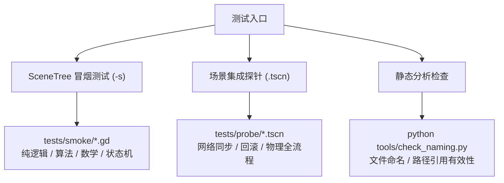

# 测试体系与验证规范

本文档说明项目的自动化测试分层结构、执行方式、判定标准及测试编写准则。

---

## 一、 测试分层架构

项目不依赖第三方测试插件，基于 Godot 引擎原生能力构建了双层测试体系：

### 1. SceneTree 纯逻辑冒烟测试 (`tests/smoke/*.gd`)
- **执行命令**：`godot --headless --path . -s res://tests/smoke/<name>.gd`。
- **环境特点**：脚本继承自 `SceneTree`。**注意：在此模式下，项目的 Autoload 单例不会自动初始化**，被测代码若依赖全局变量需显式传入或使用静态工具类。
- **覆盖范围**：环面数学计算、计分公式（`score_rules.gd`）、武器背包逻辑（`WeaponInventory`）、时间颗粒状态机（`GrainAccount`）及数据表解析。
- **通过判据**：控制台输出包含 `SMOKE OK` 且退出码为 0。

### 2. 场景集成探针 (`tests/probe/*.tscn`)
- **执行命令**：`godot --headless --path . --quit-after 3600 res://tests/probe/<name>.tscn`。
- **环境特点**：完整加载场景树与 Autoload 单例。`--quit-after 3600` 提供最大帧数超时保护（约 60 秒），防止死锁挂起。探针测试执行完毕后通常主动调用 `get_tree().quit(0)` 退出。
- **覆盖范围**：物理碰撞与穿透、伤害结算、客户端预测与回滚、双端网络同步与断线重连。
- **通过判据**：控制台输出包含 `ALL-OK`。

### 3. 测试辅助工具 (`tests/lib/`)
- **`ScanUtil` (`tests/lib/scan_util.gd`)**：代码文本分析工具，支持文件过滤、注释剥离与函数提取。
- **`ProbeBase` (`tests/lib/probe_base.gd`)**：探针基类节点，提供标准断言方法、错误汇总与总结打印。

---

## 二、 测试编写规范与准则

### 1. 输出文本标识优先于退出码
Godot 在某些脚本异常退出时可能返回状态码 0。因此：
- 自动化测试的成功判定一律以标准输出中是否打印出 `ALL-OK` 或 `SMOKE OK` 为准。
- 探针内应包含断言执行计数校验，防止函数因意外提前返回而跳过后续断言。

### 2. 真实流程驱动
设计探针测试时，应尽可能由真实的输入、物理碰撞或网络 RPC 驱动完整流程，避免直接手动修改下游属性造成虚假通过。

### 3. 规避端口占用与残留进程
运行网络集成测试前后，确保关闭遗留的 Godot 后台进程，防止 7777 或动态端口被占用导致测试假失败。

---

## 三、 常用核心测试用例

| 模块 | 测试脚本 | 测试重点 |
|---|---|---|
| **敌人逻辑** | `tests/smoke/enemy_logic_smoke.gd` | 敌人属性、武器注册表校验、AABB 碰撞盒。 |
| **武器背包** | `tests/smoke/weapon_inventory_smoke.gd` | 背包 8 格容量与 4 把数量限制、换弹与实例 ID。 |
| **计分规则** | `tests/smoke/score_rules_smoke.gd` | 击杀、助攻、自伤与团队伤害惩罚分计算。 |
| **时间颗粒** | `tests/smoke/grain_account_smoke.gd` | 颗粒扣除、透支锁定与自动回复。 |
| **断线重连** | `tests/smoke/grace_window_smoke.gd` | 60 秒宽限期进入与超时处置。 |
| **联机大厅** | `tests/smoke/pvp_room_smoke.sh` | 房间创建、大厅列表与加入流程全链路。 |
| **工程规范** | `python tools/check_naming.py` | 目录与文件名小写、类名映射、文档路径有效性。 |
