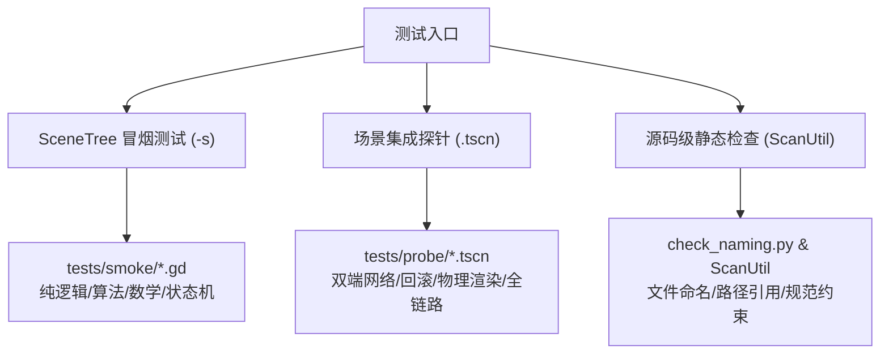

# 测试体系与验证规范 (冒烟测试 / 集成探针 / 代码扫描 / 运行纪律)

> 本文档规范 Cyber Ruins (CyR) 的自动化测试架构、测试分层、断言模式与运行纪律。
> 返回索引：[`CLAUDE.md`](../../CLAUDE.md)。

---

## 一、测试分层架构

项目不依赖第三方测试框架，采用基于 Godot 引擎原生能力的双层测试体系：

### 1. SceneTree 纯逻辑冒烟测试 (`tests/smoke/*.gd`)
- **运行方式**：`godot --headless --path . -s res://tests/smoke/<name>.gd`。
- **执行环境**：脚本继承自 `SceneTree`。注意：**该模式下 Autoload 单例不会自动初始化**。
- **职责范围**：纯算法计算（环面坐标数学、计分公式 `score_rules.gd`）、独立状态机（`GrainAccount`、`RejoinRegistry`）、以及数据解析与格式验证。
- **异常防护**：在 `_initialize()` 中对资源加载做空指针保护，避免脚本异常导致测试进程永久挂起。

### 2. 场景集成探针 (`tests/probe/*.tscn`)
- **运行方式**：`godot --headless --path . --quit-after 3600 res://tests/probe/<name>.tscn`。
- **执行环境**：完整加载场景树与 Autoload 单例。
- **职责范围**：物理碰撞与穿透、武器射击与伤害仲裁、C2 预测回滚真实行为、双端网络同步与断线重连。
- **安全退出机制**：`--quit-after 3600` 作为看门狗安全兜底（单位为物理帧）。探针测试完成时通常自行调用 `get_tree().quit(0)` 提前退出。

### 3. 测试脚手架工具集 (`tests/lib/`)
- **`ScanUtil` (`tests/lib/scan_util.gd`)**：纯静态文本分析工具，提供文件遍历、注释剔除、括号实参提取、函数体切片等基础解析能力。
- **`ProbeBase` (`tests/lib/probe_base.gd`)**：探针基类（继承 `Node`），统一管理断言账本 `_failures`、测试计数与总结输出。测试通过的唯一权威标识是终端输出 `ALL-OK`。

---

## 二、测试判据与设计纪律

### 1. 判据权威性：文本标记优先于退出码
Godot 在部分脚本执行异常时可能默认退出码为 0。因此：
- 探针与冒烟测试的结果判定一律以标准输出中是否打印对应的 `ALL-OK`（或对应格式标记）为准。
- 引入断言执行计数检查（如 `_checks >= EXPECTED_CHECKS`），防止函数因异常提前中断导致断言被跳过却误报通过。

### 2. 真实行为测试 vs 模拟写入隔离
设计探针时须严格区分“测试环境搭建准备”与“被测目标代码真实触发”：
- 严禁通过探针代码手动调用下游结果接口来模拟中间逻辑；必须由真实的输入源、碰撞事件或网络 RPC 驱动完整链路。
- 针对边界情况（如友军伤害阻挡、自伤规避），必须同时设立正向通过用例与反向阻断用例。

### 3. 跨测试进程清理规范
- 在执行真实网络链路测试（如带有子进程 worker 或多客户端的测试）前后，必须确保清理遗留的后台 Godot 进程。
- 避免因前序测试超时的僵尸进程占用网络端口（如 7777 或动态端口池），导致后续测试因端口监听冲突而失败。

---

## 三、常用核心测试用例索引

| 分类 | 核心测试文件 | 测试内容 |
|---|---|---|
| **敌人与物理** | `tests/smoke/enemy_logic_smoke.gd` | 敌人 AI 状态机、环面视线与寻路、碰撞层规范 |
| **武器与射击** | `tests/smoke/laser_weapon_smoke.gd` `tests/probe/weapon_pickup_probe.tscn` | 激光折线碰撞、地面武器拾取与槽位管理 |
| **预测与回滚** | `tests/probe/replica_ghost_probe.tscn` `tests/probe/rollback_fidelity_probe.tscn` | 远端对手幽灵阻挡体、贴身容差与回滚收敛 |
| **网络与对战** | `tests/smoke/pvp_room_smoke.sh` `tests/probe/reconnect_probe.tscn` | 房间流转、全链路断线重连与断线补态 |
| **团队与结算** | `tests/probe/team_table_probe.tscn` `tests/probe/stats_delivery_probe.tscn` | 3v3 队伍映射、友军免伤与全模式结算数据下发 |
| **时间机制** | `tests/smoke/grain_account_smoke.gd` `tests/probe/rewind_probe.tscn` `tests/probe/haste_probe.tscn` | 怀表时间粒子账户、快照回溯与时间加速效果 |
