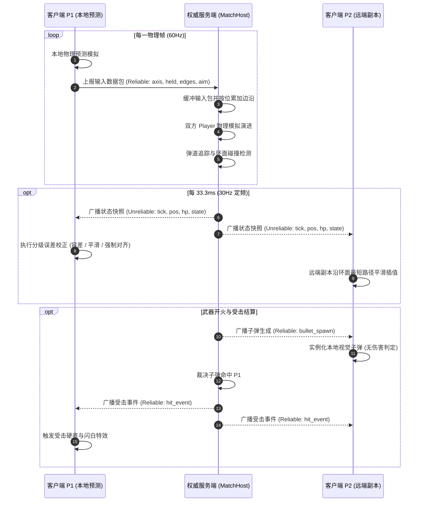

# PvP 网络架构与状态同步设计规范

本文档详述游戏 PvP 联机系统的网络架构设计、权威状态同步机制、客户端预测校正算法及端到端通信协议规范。

---

## 一、 系统架构总览

### 1. 核心设计原则
系统采用 **权威专用服务器（Authoritative Dedicated Server）结合客户端预测（Client-Side Prediction）** 架构：
- **服务端权威模拟**：由运行在无头模式（Headless）下的专用服务器独立模拟物理世界（包含角色物理移动、弹道演算、碰撞检测、伤害裁决与场景瓦片破坏）。客户端不进行任何伤害与胜负裁决。
- **客户端本地预测**：本地玩家在客户端运行完整的角色物理逻辑，实现零输入延迟的操作反馈；服务端以 30Hz 频率向下广播世界状态快照，客户端据此对远端对手进行插值展示，并对本地角色进行预测误差校正。
- **环面世界拓扑规范**：
  1. 网络协议传输的位置数据**一律采用标准基准坐标（Canonical Coordinates）**，约束在 `[0, MAP_WIDTH)` 与 `[0, MAP_HEIGHT)` 范围内。
  2. 客户端渲染层根据本地玩家视口位置，将目标动态映射至最近的环面投影副本（`anchor_to_nearest`）。
  3. 状态插值与预测误差计算统一使用环面最短向量增量（`toroidal_delta_px`），严禁跨地图边界直接进行欧氏线性插值，杜绝接缝处的穿透滑屏现象。
- **统一通信总线**：双端共用全局单例 `NetBus` 作为网络 RPC 与底层连接事件的统一收口，支持跨场景路由与业务解耦。

### 2. 进程拓扑与通信模型

```
┌───────────────────────── 独立服务端进程 (--headless) ───────────────────────────┐
│  server_main.gd ── RoomManager (房间管理与匹配注册表)                               │
│                         └─ MatchHost × N (每个房间运行独立的对局模拟实例)              │
│                              ├─ WorldBuilder (加载网格，构建物理碰撞，无渲染负载)       │
│                              ├─ Player 实例 × 2 (注入 NetworkInputSource 驱动物理模拟) │
│                              └─ 弹道演算 + 环面命中裁决 + 30Hz 状态快照广播            │
└──────────────────────────────────────────────────────────────────────────────────┘
        ▲ 60Hz 可靠通道 (Reliable) 客户端输入数据包    ▼ 30Hz 不可靠通道 (Unreliable) 状态快照 / 可靠事件
┌────────────────────────┐                  ┌────────────────────────┐
│  客户端 P1 (Host/Guest) │     完全对等     │  客户端 P2 (Host/Guest) │
│  pvp_game.gd           │                  │  pvp_game.gd           │
│  ├─ Level0 物理世界     │                  │  ├─ Level0 物理世界     │
│  ├─ 本地玩家 (物理预测) │                  │  ├─ 本地玩家 (物理预测) │
│  └─ PlayerReplica 副本 │                  │  └─ PlayerReplica 副本 │
└────────────────────────┘                  └────────────────────────┘
```

### 3. 场景生命周期流转

```
main_menu.tscn (主菜单)
  ├─ 单人模式 ── 复位 Level0.pvp_mode = false ── 进入单人关卡 Level0.tscn
  └─ 多人联机 ── PvpSession.reset() ── 进入匹配界面 matchmaking.tscn
        ├─ 创建房间：连接服务端 ── 发送 create_room RPC ── 获取房间号 ── 等待对手加入
        └─ 加入房间：连接服务端 ── 发送 join_room RPC ── 校验通过
        └─ 玩家就绪：服务端广播 match_start(role, spawn, map) ── 双端切换至 pvp_game.tscn 进入对局
```

---

## 二、 模块架构与职责划分

| 模块路径 | 架构角色 | 核心职责说明 |
|---|---|---|
| `core/net/net_bus.gd` | **全局网络总线 (Autoload)** | ENet 实例创建与销毁、RPC 接口统一声明、底层连接事件向业务信号的转发与收口 |
| `core/net/pvp_session.gd` | **会话数据上下文** | 跨场景持久化保存对局参数（角色分配、出生点坐标、地图路径、服务器地址与端口） |
| `server/server_main.gd` | 服务端主入口 | 调用 `NetBus.start_server()` 初始化监听并挂载 `RoomManager` 服务节点 |
| `server/room_manager.gd` | 房间注册与调度管理 | 维护房间字典、处理建房与加入请求、监控玩家掉线、并在对局就绪时实例化 `MatchHost` |
| `server/match_host.gd` | **服务端对局模拟器** | 场景与碰撞构建、双端实体物理演进、弹道追踪、伤害结算与 30Hz 状态快照广播 |
| `scenes/pvp_game.gd` | 客户端对局控制器 | 管理本地角色物理预测、60Hz 输入打包上报、接收快照执行分级误差纠偏、维护对手副本 |
| `scenes/player/player_replica.gd` | 远端玩家副本 | 纯视觉展示节点，执行基于环面最短路径的平滑插值，不参与本地物理演算 |
| `scenes/matchmaking.gd` | 匹配大厅 UI 控制器 | 负责建房请求、加入房间校验、房间号展示与等待状态交互 |
| `scenes/main_menu.gd` | 主界面导航控制器 | 单人与联机模式路由分支、网络上下文与参数复位 |
| `core/input/input_source.gd` | 输入抽象基类 | 客户端本地输入源，封装 Godot 原生 `Input` 接口 |
| `core/input/network_input_source.gd` | 网络输入源 | 服务端专用输入源，解包网络上报的输入数据并注入实体物理模拟 |

---

## 三、 网络通信层：NetBus

`NetBus` 作为全局自动加载单例（`/root/NetBus`）运行，基于 Godot 原生 `ENetMultiplayerPeer` 封装：
- **监听配置**：默认端口 `7777`，服务端通过 `create_server(port, 16, ENet_CHANNELS)` 初始化，支持最多 16 个连接，显式分配 4 个 ENet 传输通道（`SYSCH_RELIABLE = 0`, `SYSCH_UNRELIABLE = 1` 等）。
- **解耦设计**：`NetBus` 仅负责通信声明、通道路由与发送方鉴权，不与具体游戏玩法强耦合；通过信号将网络事件解耦分发至 `RoomManager` 与 `MatchHost`。
- **身份鉴权防护**：所有服务端 RPC 处理函数中均调用 `multiplayer.get_remote_sender_id()` 获取真实的对端 Peer ID，防范请求伪造与越权调用。

### 核心 RPC 接口契约

| RPC 方法 | 调用方向 | 传输模式 | 业务功能说明 |
|---|---|---|---|
| `create_room()` | 客户端 → 服务端 | Reliable | 请求创建对战房间，服务端触发 `room_create_requested` |
| `join_room(code)` | 客户端 → 服务端 | Reliable | 请求加入指定房间号，服务端触发 `room_join_requested` |
| `send_input(pkt)` | 客户端 → 服务端 | **Reliable** | 客户端上报物理帧输入包，服务端触发 `input_received` |
| `snapshot(snap)` | 服务端 → 客户端 | **Unreliable** | 下发 30Hz 世界状态快照，客户端触发 `local_snapshot` |
| `bullet_spawn(data)` | 服务端 → 客户端 | Reliable | 广播新子弹生成事件，供非射手端生成对应的视觉弹道 |
| `hit_event(victim, dmg, pos)` | 服务端 → 客户端 | Reliable | 广播受击与伤害事件，触发客户端受击闪白与击退动画 |
| `room_created(code)` | 服务端 → 客户端 | Reliable | 响应建房请求，返回分配的 5 位房间号 |
| `room_joined(role)` | 服务端 → 客户端 | Reliable | 响应加入请求，返回分配的角色编号 (1 或 2) |
| `match_start(role, spawn, map)` | 服务端 → 客户端 | Reliable | 广播对局开始，携带出生点与地图配置 |
| `server_message(text)` | 服务端 → 客户端 | Reliable | 下发系统级提示信息或错误通知 |

---

## 四、 房间管理与对局建立：RoomManager

`RoomManager` 在服务端维护全局对战房间表 `rooms: Dictionary[String, Room]`。

### 房间数据结构
```gdscript
class Room:
    var code: String                 # 5 位唯一房间号
    var players: Array[int]          # 加入房间的 Peer ID 列表
    var player_role: Dictionary      # Peer ID -> 角色编号 (1 或 2)
    var match_host: Node             # 该房间对应的 MatchHost 模拟实例
```

### 业务流转时序
1. **创建房间**：客户端发起 `create_room`，服务端生成不冲突的 5 位随机房间号，将发起者设置为角色 1，通过 `rpc_id` 回复 `room_created`。
2. **加入与开局**：第二个客户端发起 `join_room`，服务端校验房间状态与容量；校验通过后将其设为角色 2。当 2 名玩家就绪后，立即调用 `_start_match` 启动对局流程。
3. **环境初始化**：读取地图数据中的出生点配置（`player` 与 `player2`），向双方发送 `match_start` RPC，并在服务端场景树动态挂载 `MatchHost.new(map_path, role_peers)` 实例。
4. **异常离线处理**：监听 `peer_left` 信号，在玩家异常断开时移出房间；当房间内玩家全部退出后，及时释放 `MatchHost` 实例并清理房间记录。

---

## 五、 服务端权威对局模拟：MatchHost

每个房间独立运行一个 `MatchHost` 节点，承载整张地图环境与双方角色的物理模拟。

### 1. 场景与物理初始化
- 调用 `MazeGenerator` 与 `WorldBuilder` 加载地图碰撞网格与子格生命值表（`TileDefs.init_hp`），构建静态墙体、可破坏碰撞区块以及攀爬梯子。**服务端仅生成轻量物理碰撞体，不加载任何纹理与视觉节点**。
- 实例化两个 `Player` 节点，为其装配 `NetworkInputSource` 输入源，并根据出生点坐标初始化物理状态。

### 2. 物理帧处理时序 (`_physics_process`)

严格按照以下顺序串行演进，保障时序确定性：
1. **输入消费与注入**：遍历每个角色，调用 `NetworkInputSource.clear_edges()` 清空上一帧的瞬态按键边沿；随后消费输入缓冲队列，持续状态更新为最新值，瞬态边沿进行位或运算累加。
2. **引擎物理推进**：Godot 场景树自动驱动子节点 `Player` 与子弹实体的 `_physics_process`（父节点先于子节点执行，确保角色读取到本帧注入的输入）。
3. **弹道演进与命中裁决 (`_adjudicate_bullets`)**：计算子弹与角色的环面最短欧氏距离，命中成立时执行伤害结算并下发可靠事件广播。
4. **状态快照广播**：依据 30Hz 定频时钟，将当前世界状态序列化后通过不可靠通道广播下发。
5. **动态碰撞分帧重建**：处理场景破坏产生的脏区块标记（每物理帧最多分批重建 2 块，平滑 CPU 瞬时负载）。

### 3. 输入消费策略：队列缓冲 + 状态覆盖 / 边沿累加
客户端物理帧输入通过 `_pending_input[role]` 队列缓冲，在服务端每物理帧开始时批量处理：
- **持续量与方向（held / axis / aim / weapon）**：**覆盖取最新**，确保服务端姿态实时追踪客户端输入，消除操控滞后感。
- **单帧瞬态边沿（just_pressed / just_released）**：**按位或累加（`|=`）**，防止在网络轻微抖动导致多包同批到达时丢失关键的跳跃、抓梯或开火边沿触发。

### 4. 状态快照数据结构 (30Hz Unreliable)

```jsonc
{
  "tick": 1280,             // 单调递增快照序号，用于客户端丢弃迟到或乱序快照
  "players": {
    "1": {
      "pos": Vector2,       // 标准基准坐标 Canonical [0, MAP)
      "vel": Vector2,       // 当前物理速度矢量
      "facing": 1,          // 朝向 (-1: 左, 1: 右)
      "pose": 0,            // 姿态枚举 (0:idle, 1:move, 2:fly, 3:charge, 4:squat)
      "weapon": 1,          // 当前手持武器槽位索引
      "hp": 100,            // 角色生命值 (由服务端权威裁决)
      "waterproof": 100,    // 防水/氧气值
      "downed": false       // 倒地瘫痪状态
    },
    "2": { ... }
  }
}
```

### 5. 弹道追踪与命中判定
- **去重广播机制**：服务端维护 `_seen_bullets` 集合。当新子弹生成时，仅向**非射手客户端**广播 `bullet_spawn` 事件（射手端已在本地开火时进行了本地视觉预测生成，避免出现重复子弹）。
- **环面命中检测**：计算子弹与目标角色在环面上的最短欧氏距离 `toroidal_delta_px(bullet.pos, player.pos).length() < HIT_RADIUS(40px)`。
- **伤害结算**：判定命中后调用目标实体的 `take_hit`，向双方广播可靠的 `hit_event` 事件，并立即在服务端销毁对应子弹。

---

## 六、 客户端预测与误差校正：pvp_client

客户端入口为 `scenes/pvp_game.gd`，加载 `Level0` 并开启 `pvp_mode = true`。

### 1. 物理帧输入打包上报
客户端每物理帧采样当前输入状态，打包为结构化数据并上报服务端：

```jsonc
{
  "ax": 1.0,               // 水平轴输入 (-1.0 ~ 1.0)
  "held": 0b0111,          // 持续按键位掩码
  "pressed": 0b0001,       // 本物理帧刚按下的边沿掩码
  "released": 0b0000,      // 本物理帧刚松开的边沿掩码
  "weapon": 1,             // 目标武器槽位索引
  "aim": Vector2(0.8, -0.6)// 鼠标瞄准方向单位向量
}
```

### 2. 快照接收与分级误差校正策略 (`_self_correct`)
客户端收到状态快照后，首先核验快照 `tick`；若小于已处理的最大序号，则直接丢弃乱序或迟到快照。

针对本地玩家的预测状态，系统采用**分级误差校正策略**，在保证操作反馈连贯性的同时抑制位置拉扯现象：

| 预测误差区间 ($\Delta$) | 处理策略 | 设计目标与手感保障 |
|---|---|---|
| **$\Delta \le 64\text{px}$ (1 格以内)** | **允许容差，不予纠偏** | 属于网络往返延迟下的合理预测领先量，完全由本地预测主导，保持操作丝滑 |
| **$64\text{px} < \Delta \le 128\text{px}$** | **指数平滑修正 (`rate = 0.35`)** | 出现中度累积偏差，每物理帧沿环面最短向量向权威状态平滑靠近，无视觉跳跃 |
| **$\Delta > 128\text{px}$ (2 格以上)** | **强制对齐 (Hard Snap)** | 发生严重物理分歧（如受击击退、阻挡或传送），立即重置至权威坐标，防止穿模 |

- **数值属性严格同步**：生命值、氧气值与倒地状态不做插值，完全以服务端快照数据为权威基准。
- **环面最短路径计算**：所有纠偏向量计算均严格基于 `toroidal_delta_px`，杜绝角色在跨越地图回绕边界时产生异常反向拉扯。

---

## 七、 远端玩家副本展示：PlayerReplica

远端玩家在本地表现为轻量视觉节点 `PlayerReplica`（基于 `Node2D` 与 `AnimatedSprite2D`），不挂载物理碰撞体，不执行本地物理模拟：
- **环面坐标对齐**：收到快照基准坐标后，通过 `anchor_to_nearest(canonical, local_anchor)` 将其映射到距离本地玩家最近的投影副本位置。
- **指数平滑插值**：在 `_process` 渲染帧中，通过指数平滑公式更新远端玩家坐标：
  $$\text{pos} \mathrel{+}= \text{toroidal\_delta\_px}(\text{pos}, \text{target}) \times (1 - e^{-\text{INTERP\_RATE} \times \Delta t})$$
  其中平滑系数 $\text{INTERP\_RATE} = 12.0$，在网络抖动环境下依然保持平滑自然的动作视觉呈现。

---

## 八、 输入源抽象解耦：InputSource

为保证核心 `Player` 逻辑在单机与联网环境下无缝复用，系统通过 `InputSource` 抽象隔离底层输入差异：

```
                ┌──────────────────┐
                │   InputSource    │ (抽象基类：默认对接全局 Input)
                └────────┬─────────┘
                         │
          ┌───────────────┴───────────────┐
          ▼                               ▼
┌──────────────────┐           ┌──────────────────────┐
│   InputSource    │           │ NetworkInputSource   │
│ (客户端本地玩家)  │           │ (服务端注入网络输入)  │
└──────────────────┘           └──────────────────────┘
```

- **统一接口封装**：统一抽象了 `get_axis`、`is_action_pressed`、`is_action_just_pressed`、`is_attack_pressed` 以及 `get_aim_dir_override`。
- **逻辑完全复用**：`Player.gd` 与 `WeaponBase.gd` 仅面向 `input_source` 编程。单人模式下读取物理外设输入，服务端环境下读取解包后的网络数据，实现物理模拟的高保真还原。

---

## 九、 端到端数据流时序



---

## 十、 自动化测试与验证

### 1. 冒烟测试与探针套件

| 测试用例脚本 | 验证范围与断言目标 |
|---|---|
| `tests/pvp_room_smoke.sh` | 验证多客户端无头启动、连接大厅、建房、输入房间号加入并成功接收 `match_start` 流程 |
| `tests/pvp_match_smoke.sh` | 验证回环网络下输入上报、服务端物理模拟、30Hz 快照下发与子弹生成广播的完整链路 |
| `tests/ground_net_probe.tscn` | 验证网络环境下的地面武器生成、位置同步与交互拾取准确性 |
| `tests/royale_probe.tscn` | 验证大乱斗模式下多客户端接入、生命周期流转与高频数据交互稳定性 |

### 2. 执行指令

```bash
# 验证房间创建与匹配连接链路
bash tests/pvp_room_smoke.sh

# 验证双客户端状态同步与权威对局模拟
bash tests/pvp_match_smoke.sh
```
